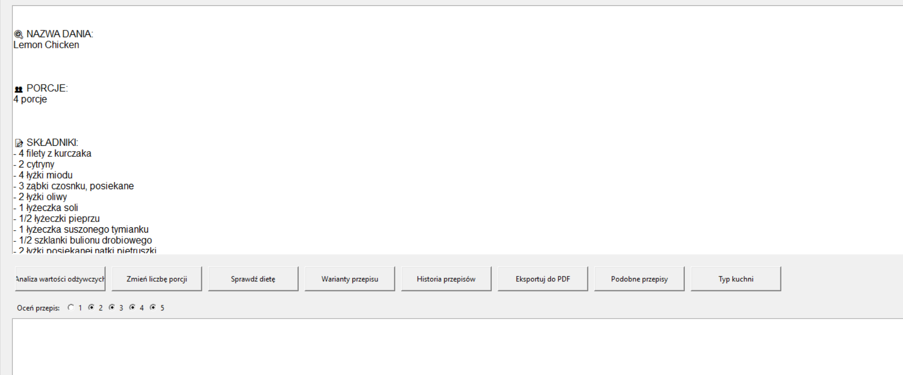
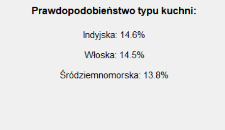
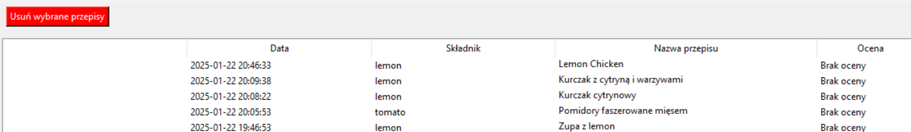

# AI Recipe Generator

Generator przepisów kulinarnych wykorzystujący sztuczną inteligencję do rozpoznawania składników ze zdjęć i generowania przepisów.

## 🌟 Funkcjonalności

- Rozpoznawanie składników ze zdjęć przy użyciu modeli głębokiego uczenia (ResNet50, EfficientNetB0, MobileNetV2)
- Generowanie przepisów kulinarnych z wykorzystaniem OpenAI GPT
- Rekomendacje podobnych przepisów
- Interfejs graficzny do łatwej interakcji z aplikacją
- Historia wygenerowanych przepisów

## 📱 Przykłady użycia

### Rozpoznawanie składników

*Okno rozpoznawania składników ze zdjęcia*

### Główne okno przepisu

*Wygenerowany przepis z opcjami*

### Klasyfikacja typu kuchni

*Okno z klasyfikacją typu kuchni*

### Historia przepisów

*Okno historii przepisów*

## 💻 Wymagania

- Python 3.10+
- Tensorflow 2.13+
- PyTorch 2.1+
- Transformers 4.35+
- Pozostałe zależności w `pyproject.toml`
- Klucz API OpenAI (w pliku `.env`)


## 🧠 Modele AI

### 1. Model rozpoznawania składników

#### MobileNetV2
- Dokładność: 89.2%
- Precyzja: 88.7%
- Recall: 87.9%
- AUC: 0.982

#### ResNet50
- Dokładność: 92.8%
- Precyzja: 91.9%
- Recall: 91.5%
- AUC: 0.989

#### EfficientNetB0
- Dokładność: 91.5%
- Precyzja: 90.8%
- Recall: 90.3%
- AUC: 0.987

- Obsługiwane składniki: 36 kategorii

### 2. Model rekomendacji (Sentence Transformers)
- Model: paraphrase-multilingual-MiniLM-L12-v2
- Funkcje: znajdowanie podobnych przepisów
- Język: wielojęzyczny (w tym polski)

### 3. Model klasyfikacji kuchni (XLM-RoBERTa)
- Model: xlm-roberta-base
- Klasyfikowane kuchnie: polska, włoska, azjatycka, meksykańska, francuska, śródziemnomorska, indyjska, amerykańska
- Dokładność: wielojęzyczna analiza tekstu

## 🚀 Instalacja

1. Sklonuj repozytorium:
```bash
git clone https://github.com/twoj-username/NAIProjekt.git
cd NAIProjekt
```

2. Zainstaluj Git LFS (jeśli nie jest zainstalowany):
```bash
git lfs install
```

3. Utwórz i aktywuj wirtualne środowisko:
```bash
python -m venv venv
source venv/bin/activate  # Linux/macOS
# lub
venv\Scripts\activate  # Windows
```

4. Zainstaluj zależności:
```bash
pip install -e .
```

5. Utwórz plik `.env` w głównym katalogu projektu i dodaj klucz API OpenAI:
```
OPENAI_API_KEY=twoj-klucz-api
TOKENIZERS_PARALLELISM=true
```

6. Pobierz model:
   - Opcja A: Pobierz wytrenowany model z [Google Drive](https://drive.google.com/drive/folders/1MobjEblArzMQ2FGiFK2UGwITGrcN5ERs?usp=sharing) i umieść w `models/`
   - Opcja B: Wytrenuj własne modele (wymaga pobrania datasetu):
     ```bash
     # Trenowanie MobileNetV2
     python train.py
     
     # Trenowanie ResNet50
     python train_resnet.py
     
     # Trenowanie EfficientNetB0
     python train_efficientnet.py
     ```

     Każdy model zostanie zapisany w katalogu `src/models/` z odpowiednią nazwą:
     - `trained_model.keras` (MobileNetV2)
     - `trained_model_resnet.keras` (ResNet50)
     - `trained_model_efficientnet.keras` (EfficientNetB0)

## 📸 Przygotowanie zdjęć

1. Umieść zdjęcia składników w katalogu `Vegetables/`
2. Obsługiwane formaty: JPG, JPEG, PNG
3. Zalecana rozdzielczość: minimum 150x150 pikseli

## 🎯 Użycie

1. Uruchom program:
```bash
python main.py
```

2. Z menu głównego możesz:
   - Generować nowe przepisy ze zdjęć
   - Przeglądać historię przepisów

3. Podczas generowania przepisu:
   - Wybierz standardowy przepis lub własny pomysł
   - Poczekaj na wygenerowanie przepisu
   - Korzystaj z dodatkowych funkcji w oknie przepisu

## 💡 Funkcje dodatkowe

- **Analiza wartości odżywczych**: Oblicza kalorie, białko, tłuszcze i węglowodany
- **Zmiana liczby porcji**: Automatycznie przelicza ilości składników
- **Sprawdzanie diety**: Weryfikuje zgodność z dietami (wegańska, wegetariańska, bezglutenowa, keto)
- **Warianty przepisu**: Generuje zdrowsze, szybsze i budżetowe wersje
- **Eksport do PDF**: Zapisuje przepis w formacie PDF z formatowaniem
- **Historia przepisów**: Przeglądaj i oceniaj wcześniej wygenerowane przepisy

## ❓ FAQ

### Jak dodać własne zdjęcia składników?
Umieść zdjęcia w formacie JPG/PNG w katalogu `Vegetables/`. Minimalna rozdzielczość to 150x150 pikseli.

### Jak wytrenować własny model?
1. Pobierz dataset z [Kaggle](https://www.kaggle.com/datasets/kritikseth/fruit-and-vegetable-image-recognition)
2. Umieść dane w katalogu `archive/`
3. Uruchom `python train.py`

### Jakie są wymagania sprzętowe?
- RAM: minimum 8GB
- GPU: opcjonalnie (przyspiesza działanie)
- Dysk: około 2GB wolnego miejsca

## 📝 Struktura projektu

```
NAIProjekt/
├── main.py                 # Główny plik aplikacji
├── recipe_recommender.py   # Model rekomendacji przepisów
├── cuisine_classifier.py   # Model klasyfikacji typu kuchni
├── src/
│   ├── models/            # Zapisane modele
│   ├── Recipes/           # Wygenerowane przepisy
│   └── Vegetables/        # Zdjęcia składników
└── tests/                 # Testy jednostkowe
```


## 📫 Kontakt

- GitHub: [MieszkoBu](https://github.com/MieszkoBu)
- Email: mieszkobu@wp.pl

## 📄 Licencja

Ten projekt jest objęty licencją MIT - szczegóły w pliku [LICENSE](LICENSE)

## ⚠️ Znane problemy

- Program może działać wolniej na komputerach bez GPU
- Wymagane jest stabilne połączenie internetowe

## 🙋‍♂️ Wsparcie

W razie problemów:
1. Sprawdź sekcję [Issues](https://github.com/MieszkoBu/NAIProjekt/issues)
2. Utwórz nowe zgłoszenie z dokładnym opisem problemu
